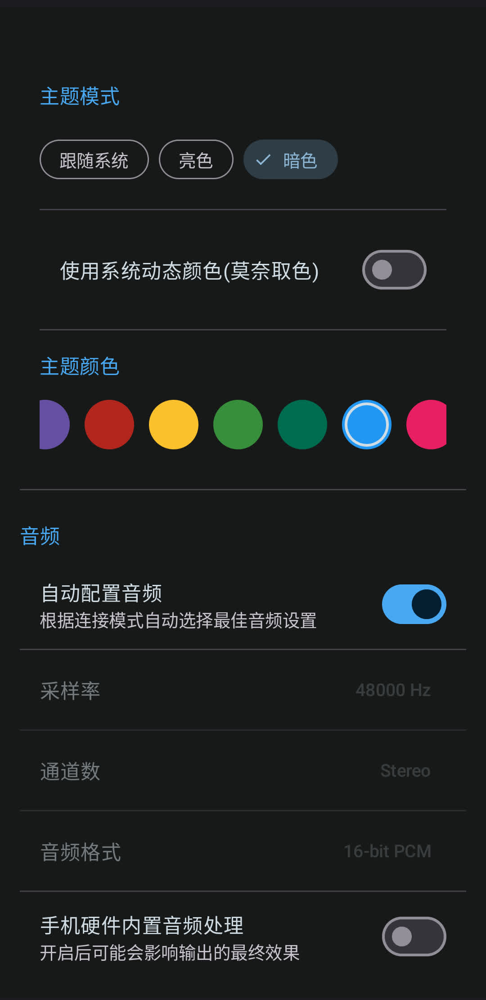

# MicYou

<p align="center">
  
</p>

<p align="center">
  <a href="./README_ZH.md">简体中文</a> | <a href="./README_TW.md">繁體中文</a> | <b>English</b>
</p>

<p align="center">
  <a href="https://github.com/LanRhyme/MicYou/blob/master/LICENSE">
    </a>
  <a href="https://github.com/LanRhyme/MicYou/commits/master">
    </a>
  <a href="https://github.com/LanRhyme/MicYou/releases/latest">
    </a>
  <a href="https://aur.archlinux.org/packages/micyou-bin">
    </a>
  <a href="https://crowdin.com/project/micyou" target="_blank" rel="noopener noreferrer">
    </a>
</p>

<p align="center">


</p>

MicYou is a powerful tool that turns your Android device into a high-quality wireless microphone for your PC. Built with Kotlin Multiplatform and Jetpack Compose/Material 3.

Based on the [AndroidMic](https://github.com/teamclouday/AndroidMic) project.

## Features

- **Multiple Connection Modes**: Support for Wi-Fi, USB (ADB/AOA), and Bluetooth.
- **Audio Processing**: Built-in Noise Suppression, Auto Gain Control (AGC), and Dereverberation.
- **Cross-Platform**:
  - **Android Client**: Modern Material 3 interface, dark/light theme support.
  - **Desktop Server**: Receive audio on Windows/Linux/macOS.
- **Virtual Microphone**: Works seamlessly with VB-Cable to act as a system microphone input.
- **Customizable**: Adjust sample rate, channel count, and audio format.

## Screenshots

### Android App
|                        Main Screen                        |                           Settings                            |
|:---------------------------------------------------------:|:-------------------------------------------------------------:|
|  |  |

### Desktop App


## Getting Started

### 1. Download ADB
- Download from [Android Developers](https://developer.android.com/tools/releases/platform-tools?hl=zh_cn)
- Install via package manager
  - `winget install -e --id Google.PlatformTools`
  - `sudo apt install android-tools-adb`
  - `sudo pacman -S android-tools`
  - ...

In most cases ADB will be added to your environment variables automatically. If not, please add it manually.

### 2. Enable USB Debugging
Using OneUI 8 as an example

1. Go to Settings, tap `About phone`
2. Tap `Software information`, find `Build number`, tap it **7** times. When you see "No need, developer mode has been enabled", it means the developer mode has been successfully enabled.
3. Go back to Settings, tap `Developer options`, find `USB debugging`, and enable it.

### 3. USB connection
Use a stable data cable, and set the connection mode to `USB` on both the desktop app and the Android app.

### 4. Wi-Fi connection
Ensure your Android device and PC are on the same network, and set the connection mode to `Wi-Fi` on both the desktop app and the Android app.

### Android
1. Download and install the APK on your Android device.
2. Ensure your device is on the same network as your PC (for Wi-Fi) or connected via USB.

### Windows
1. Run the desktop application.
2. Configure the connection mode to match the Android app.

### macOS

> [!IMPORTANT]
> If you are using an Apple Silicon Mac, Bluetooth mode cannot be used without Rosetta 2 translation.

To ensure your experience, you need to install some dependencies via Homebrew:

~~~bash
brew install blackhole-2ch --cask 
brew install switchaudio-osx --formulae
~~~

**BlackHole must be installed**. If you don't have Homebrew, go to https://existential.audio/blackhole/download/ to download the installer. Regardless of whether you install via Homebrew or the installer, please restart after installation.

After downloading the app from [GitHub Releases](https://github.com/LanRhyme/MicYou/releases) and installing it in your Applications folder, Gatekeeper may block it during first use.

If prompted with “Untrusted Developer,” navigate to **System Settings/System Preferences -> Privacy & Security** to allow the app to run.

If prompted with “The application is damaged,” resolve it by executing the following command:
~~~bash
sudo xattr -r -d com.apple.quarantine /Applications/MicYou.app
~~~

### Linux

#### Using pre-built packages (recommended)
Pre-built packages are available in [GitHub Releases](https://github.com/LanRhyme/MicYou/releases).

**DEB package (Debian/Ubuntu/Mint etc.):**
```bash
# Download the .deb package from GitHub Releases
sudo dpkg -i MicYou-*.deb
# If dependencies are missing:
sudo apt install -f
```

**RPM package (Fedora/RHEL/openSUSE etc.):**
```bash
# Download the .rpm package from GitHub Releases
sudo rpm -i MicYou-*.rpm
# Or use dnf/yum:
sudo dnf install MicYou-*.rpm
```

**AUR (Arch Linux and derivatives):**
```bash
# Clone the AUR repo and install the package
git clone https://aur.archlinux.org/micyou-bin.git
cd micyou-bin
makepkg -si

# Or use an AUR helper like paru/yay
paru -S micyou-bin
```

**Run the application:**
```bash
# After installation, you can run MicYou from your application menu
# Or from terminal:
MicYou
```

> [!TIP]
> Having issues? Check out the [FAQ](./docs/FAQ.md)

## Building from Source

This project is built using Kotlin Multiplatform.

**Android app (APK):**
```bash
./gradlew :composeApp:assembleDebug
```

**Desktop application (run directly):**
```bash
./gradlew :composeApp:run
```

**Build packages for distribution:**

**Windows installer (NSIS):**
```bash
./gradlew :composeApp:packageWindowsNsis
```

**Windows ZIP archive:**
```bash
./gradlew :composeApp:packageWindowsZip
```

**Linux DEB package:**
```bash
./gradlew :composeApp:packageDeb
```

**Linux RPM package:**
```bash
./gradlew :composeApp:packageRpm
```
## Internationalization (i18n)

MicYou supports multiple languages with a robust translation system. We welcome contributions to translate MicYou into your language!

### Translation via Crowdin (Recommended)

The easiest way to contribute translations is through [Crowdin](https://crowdin.com/project/micyou). No local development setup needed:

1. Visit [MicYou on Crowdin](https://crowdin.com/project/micyou)
2. Sign up or log in with your GitHub account
3. Select your language from the list
4. Translate strings directly in the web interface
5. Submit translations for review

When translations are merged, they are automatically synchronized to the repository via GitHub Actions.

### Adding a New Language (Manual)

To add a new language manually:

1. Clone the repository:
```bash
git clone https://github.com/LanRhyme/MicYou.git
cd MicYou
```

2. Copy the English translation file as a template:
```bash
cp composeApp/src/commonMain/composeResources/files/i18n/strings_en.json composeApp/src/commonMain/composeResources/files/i18n/strings_xx.json
```
Replace `xx` with your language code (e.g., `fr` for French, `es` for Spanish).

3. Edit the new JSON file and translate all string values while keeping the keys unchanged:
```json
{
  "appName": "MicYou",
  "ipLabel": "IP: ",
  ...
}
```

4. Register the new language in [Localization.kt](composeApp/src/commonMain/kotlin/com/lanrhyme/micyou/Localization.kt):

Find the `AppLanguage` enum and add your language:
```kotlin
enum class AppLanguage(val label: String, val code: String) {
    // ... existing languages ...
    French("Français", "fr"),  // Add this line
}
```

Also update the `getStrings()` function to handle your language:
```kotlin
fun getStrings(language: AppLanguage): AppStrings {
    val langCode = when (language) {
        // ... existing cases ...
        AppLanguage.French -> "fr"
        // ...
    }
    // ...
}
```

### Testing Translations

To test your translation locally:

1. Build and run the desktop app:
```bash
./gradlew :composeApp:run
```

2. Go to **Settings → Appearance → Language** and select your new language

3. Verify all strings are properly translated and layouts look correct

4. For Android app, build APK:
```bash
./gradlew :composeApp:assembleDebug
```

### Translation Workflow

- **Source language**: English (`strings_en.json`)
- **Location**: `composeApp/src/commonMain/composeResources/files/i18n/`
- **File format**: JSON
- **Currently supported**: 5+ languages including Chinese (Simplified, Traditional, Cantonese)

### Special Language Variants

Some languages have special variants:
- `strings_zh.json` - Simplified Chinese
- `strings_zh_tw.json` - Traditional Chinese (Taiwan)
- `strings_zh_hk.json` - Cantonese (Hong Kong)
- `strings_zh_hard.json` - Chinese (Hard - Easter egg)
- `strings_cat.json` - Cat language (Easter egg)

### Contributing Translations

1. **Via Crowdin** (Recommended): Join our Crowdin project for collaborative translation
2. **Via GitHub**: Submit a pull request with your new/updated translation files
3. Include the language name in English and native language in your PR title eg: Add xx(code) localization

## Contributors
<a href="https://github.com/LanRhyme/MicYou/graphs/contributors">
  
</a>

Made with [contrib.rocks](https://contrib.rocks).

## Star History

[](https://star-history.com/#lanrhyme/MicYou&Date)
